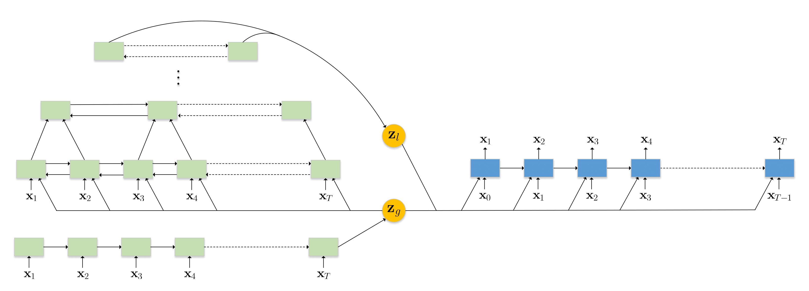
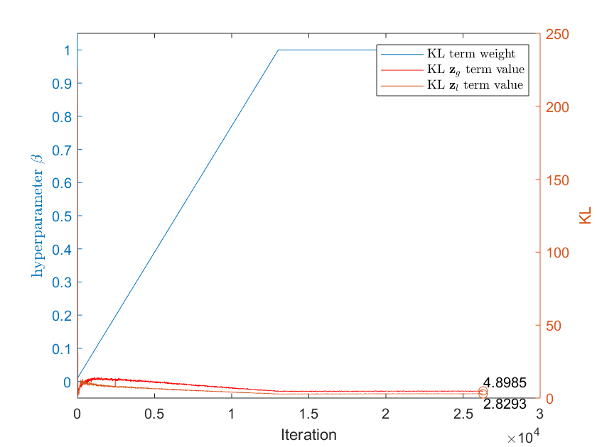
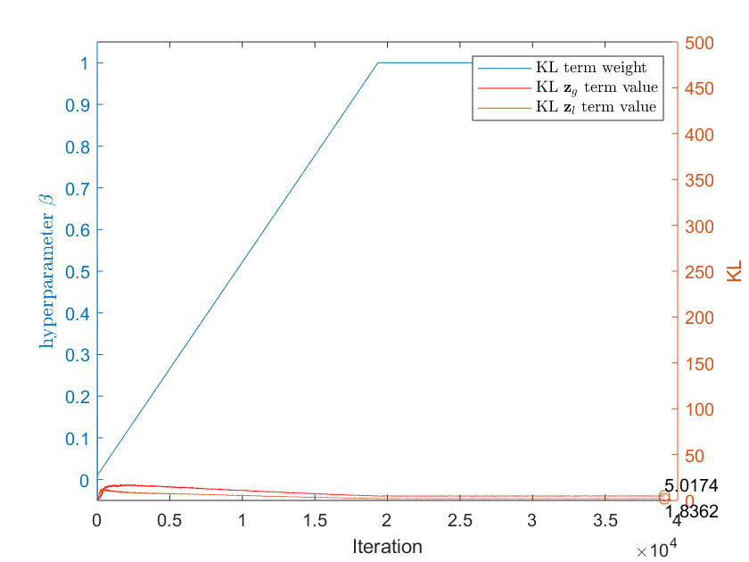

# Hierarchical Latent Variable Model for Sequence Generation
In this repository, we implement the hierarchical latent variable model for sequence generation in the Penn TreeBank and Yelp 2013. The datasets are downloaded from [Tomas Mikolov's webpage](http://www.fit.vutbr.cz/~imikolov/rnnlm/) and [Jiacheng Xu's repository](https://github.com/jiacheng-xu/vmf_vae_nlp).

This model consists of two encoders with two meaningful latent variables. The global and local dependencies of latent variables are discovered and involved in a sophisticated model for sequence generation. The long shortterm memory (LSTM) and the pyramid bidirectional LSTM (pBLSTM) are merged as two encoders to capture complimentary features for decoding of sequential outputs.

  

## Setting
- Framework:
    - Pytorch 0.4.0
- Hardware:
	- CPU: Intel Core i7-5820K @3.30 GHz
	- RAM: 64 GB DDR4-2400
	- GPU: GeForce GTX 1080ti

## Result of learning curve
|  |
| :-----------------------------------------------------: |
| Penn TreeBank                                           |

|  |
| :------------------------------------------------------: |
| Yelp 2013                                                |

## Interpolation of latent space
**mr. wathen who says pinkerton 's had a loss of nearly $ N million in N under american brands boasts that he 's made pinkerton 's profitable again**

mr. <unk> said he was pleased with his estimate of N N in N and N N in N after mr. <unk> 's departure 
in addition the company 's <unk> business is n't being acquired by <unk> 's stock market share 
in the past two months mr. <unk> said he expects to report a loss of $ N million 
in the first nine months of N shares of N N and a nominal N N 
the dow jones industrial average fell N points to N 

**in when-issued trading the notes were quoted at a price to yield N N**
